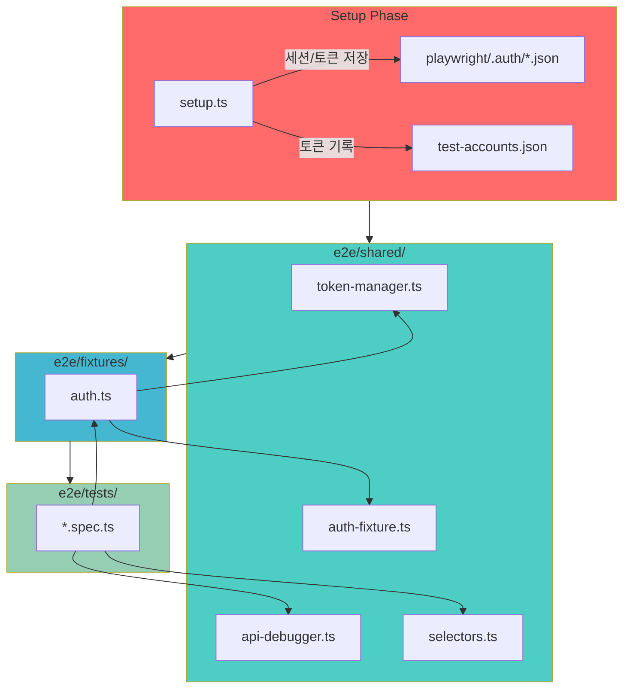

# 🚨 E2E 테스트 긴급 수정 & 강좌 생성 개선 실행 계획

## 📋 Executive Summary

E2E 테스트에서 발견된 주요 이슈는 세 가지입니다.

1. ❌ **Fixture 타임아웃** – Setup 이후 중복 로그인으로 30초 타임아웃 발생
2. ❌ **courseId 미생성** – 강좌 생성 UI 접근 불가로 API 응답 파싱 실패
3. ❌ **페이지 요소 미발견** – 광범위한 텍스트 선택자 사용으로 Strict mode 충돌

이를 해결하기 위한 3단계 로드맵을 수립했습니다.

- **Phase 0 (선행 완료)**: 강사 대시보드에서 코스 관리 진입 버튼 추가
- **Phase 1**: Fixture 구조 재설계(Setup 토큰 재사용)
- **Phase 2**: 강좌 생성 UI 흐름을 활용한 워크플로우 개선 + API 디버깅
- **Phase 3**: 선택자 라이브러리 도입 및 테스트 안정화

**목표**: 테스트 통과율 90% 이상 달성 (현 50%)

---

## ✅ Phase 0 – 강사 대시보드 개선 (완료)

### 코드 변경 요약

**파일**: `src/features/dashboard/components/InstructorDashboard.tsx`

```diff
+ import { useRouter } from 'next/navigation';
+ import { Plus } from 'lucide-react';
...
export default function InstructorDashboard() {
+  const router = useRouter();
...
      <CardHeader>
        <div className="flex items-center justify-between">
          <CardTitle>내 코스</CardTitle>
          <div className="flex items-center gap-2">
            <Badge variant="secondary">{courses.length}개 코스</Badge>
+           <Button
+             onClick={() => router.push('/courses')}
+             size="sm"
+             className="gap-1"
+           >
+             <Plus className="h-4 w-4" />
+             코스 관리
+           </Button>
          </div>
        </div>
      </CardHeader>
```

### 사용자 흐름 (Before → After)

```
Before
  강사 대시보드 → 강좌 생성 UI 없음 → API 직접 호출 필요 → courseId null

After
  강사 대시보드
    └─ [코스 관리] 버튼
       └─ /courses 페이지 이동
          ├─ 탭: 코스 목록 (list)
          └─ 탭: 새 코스 생성 (create) ✅
             ├─ 강좌명 입력
             ├─ 설명 입력
             └─ [생성] 클릭 → courseId 확보
```

### E2E 테스트 가이드 (UI 기반 강좌 생성)

```typescript
// 1. 대시보드 진입
await page.goto(`${BASE_URL}/instructor-dashboard`);

// 2. 코스 관리 페이지로 이동
await page.getByRole('button', { name: '코스 관리' }).click();
await page.waitForURL(`${BASE_URL}/courses`, { timeout: 5000 });

// 3. 새 코스 생성 탭 선택
await page.getByRole('tab', { name: '새 코스 생성' }).click();

// 4. 강좌 정보 입력
const courseTitle = `E2E Course ${Date.now()}`;
await page.fill('input[name="title"]', courseTitle);
await page.fill('textarea[name="description"]', 'E2E Integration Test');

// 5. 강좌 생성
await page.getByRole('button', { name: /생성|생성하기/i }).click();
await page.waitForLoadState('networkidle');

// 6. courseId 추출 (URL 또는 링크에서)
const url = page.url();
const courseId = url.split('/').pop();
expect(courseId).toBeTruthy();

// 7. 공유 데이터 저장
const data = loadIntegrationData();
data.courseId = courseId;
data.courseTitle = courseTitle;
saveIntegrationData(data);
```

**Fallback (API)** – UI 실패 시 APIDebugger 활용하여 courseId 추출.

---

## 🔍 근본 원인 분석

### 문제 #1 – Fixture 타임아웃 (심각도: 🔴)

```
Setup Phase
  ├─ 강사/학습자 계정 생성 및 로그인
  ├─ storageState 저장 (playwright/.auth)
  
Test Phase
  ├─ authenticatedInstructor fixture가 loginAndGetUser() 재호출
  ├─ page.goto('/login') → context 종료 → 타임아웃 (30초)
```

- **원인**: Setup에서 이미 세션이 있음에도 매 테스트마다 로그인 시도
- **영향 파일**: `e2e/fixtures/auth.ts`, `e2e/setup.ts`

### 문제 #2 – courseId 미생성 (심각도: 🔴)

```
Phase 2 (강사 워크플로우)
  ├─ UI에서 새 코스 생성 버튼 탐색 실패
  ├─ API POST /api/courses 대체 사용
  ├─ 응답 형식 불명 → courseId 추출 실패 → null 저장
  └─ Phase 3-4에서 courseId 없어서 연쇄 실패
```

- **원인**: UI 접근 경로 미비 + 응답 로깅 부재
- **영향 파일**: `e2e/tests/2-instructor-course-workflow.spec.ts`

### 문제 #3 – 페이지 요소 미발견 (심각도: 🟡)

```
page.locator('text=/강좌|course/i')
  ├─ 복수 요소 매칭 (Strict mode)
  ├─ 로드 전 탐색
  └─ 언어/레이블 변경 시 깨짐
```

- **원인**: 광범위 텍스트 선택자, wait 미흡
- **영향 파일**: `e2e/tests/course.spec.ts`, `e2e/tests/dashboard.spec.ts`

---

## 🏗️ 구현 모듈 설계 (AGENTS.md 구조 준수)

| # | 모듈 | 위치 | 설명 | 우선순위 |
|---|------|------|------|---------|
| 1 | **Token Manager** | `e2e/shared/token-manager.ts` | Supabase 토큰 추출·보관 | 🔴 P1 |
| 2 | **Auth Fixture** | `e2e/shared/auth-fixture.ts` | 토큰 기반 세션 복원 | 🔴 P1 |
| 3 | **Setup Enhancer** | `e2e/setup.ts` | 토큰 저장 및 환경변수화 | 🔴 P1 |
| 4 | **API Debugger** | `e2e/shared/api-debugger.ts` | API 응답 로깅/정규화 | 🔴 P2 |
| 5 | **Selector Library** | `e2e/shared/selectors.ts` | 안정적 선택자 제공 | 🟡 P3 |
| 6 | **Spec Updates** | `e2e/tests/*.spec.ts` | UI 흐름/선택자 적용 | 🟡 P2-P3 |

---

## 📊 시스템 다이어그램 (Mermaid)



---

## 🔧 상세 구현 계획

### Fixture란 무엇인가?

- Playwright가 테스트마다 필요한 "준비된 상태"(로그인된 페이지, 토큰 등)를 자동으로 만들어 주는 도우미입니다.
- 한 번 정의하면 각 테스트에서 `const { authenticatedInstructor } = test.extend(...)` 처럼 재사용할 수 있어, 매 테스트마다 반복적인 로그인 과정을 수행할 필요가 없습니다.
- Fixture는 **테스트 시작 전에 필요한 리소스를 세팅**하고, **테스트 종료 후 정리(cleanup)** 까지 담당합니다. (우리 프로젝트에서는 로그인된 브라우저 페이지를 열고 테스트 후 닫는 역할)

#### 이번 개선이 로그인에 미칠 수 있는 영향

| 위험 요소 | 설명 | 대응 전략 |
|-----------|------|-----------|
| 토큰 만료/삭제 | 저장된 토큰이 만료되면 세션 복원이 실패할 수 있음 | 토큰 검증 후 실패 시 UI 로그인 fallback 수행 |
| 토큰 포맷 변경 | 저장/로드 포맷이 바뀌면 기존 테스트가 깨질 수 있음 | TokenManager에서 포맷을 중앙 관리하고 변경 시 단일 지점에서 수정 |
| 세션 충돌 | 여러 테스트가 동일 스토리지 상태를 공유하면 충돌 가능 | storageState를 테스트별로 분리하고 fixture 종료 시 cleanup 철저히 수행 |
| 실제 로그인 플로우와 이탈 | 토큰 재사용만 하면 UI 변경을 감지 못할 수 있음 | fallback 로직으로 항상 UI 로그인 경로를 유지, 실패 시 즉시 감지 |

> ✅ 결론: 토큰 재사용 방식은 전체 로그인 시스템을 변경하지 않고도 타임아웃 문제를 해결할 수 있습니다. 단, **토큰이 유효하지 않을 때 자동으로 새 로그인으로 되돌리는 fallback**을 반드시 구현하여 안정성을 확보합니다.

---

### Phase 1️⃣ – 토큰 관리 & Fixture 개선 (P1)

#### 1. Token Manager 생성 (`e2e/shared/token-manager.ts`)

```typescript
export class TokenManager {
  static async extractToken(page: Page): Promise<string>;
  static async saveToken(role: 'instructor' | 'learner', token: string): Promise<void>;
  static loadToken(role: 'instructor' | 'learner'): string | null;
  static async validateToken(page: Page, token: string): Promise<boolean>;
  static async restoreSession(page: Page, token: string): Promise<void>;
}
```

**Unit Test** (`e2e/shared/__tests__/token-manager.test.ts`)

```typescript
test('토큰 저장/로딩', async () => {
  const token = 'test-token';
  await TokenManager.saveToken('instructor', token);
  expect(TokenManager.loadToken('instructor')).toBe(token);
});

test('페이지에서 토큰 추출', async ({ page }) => {
  const token = await TokenManager.extractToken(page);
  expect(token).toBeTruthy();
});
```

#### 2. Setup 개선 (`e2e/setup.ts`)

- Supabase 토큰 추출 → TokenManager 저장
- `test-accounts.json`에 토큰/계정 기록
- 필요 시 `.env.test`에 `INSTRUCTOR_TOKEN`/`LEARNER_TOKEN` 저장

#### 3. Fixture 재설계 (`e2e/fixtures/auth.ts` → `e2e/shared/auth-fixture.ts`)

- Setup에서 저장한 토큰 우선 사용
- 실패 시 로그인 fallback

```typescript
authenticatedInstructor: async ({ page }, use) => {
  const token = TokenManager.loadToken('instructor');

  if (token) {
    await TokenManager.restoreSession(page, token);
    const user = await getUserProfile(page, token);
    await use({ page, user });
  } else {
    const user = await loginAndGetUser(page, ...);
    await use({ page, user });
  }
};
```

**QA Sheet**

- [ ] 토큰으로 API 호출 가능 (`/api/instructor-dashboard` → 200)
- [ ] Fixture 실행 시간 5초 이하
- [ ] 타임아웃 미발생

---

### Phase 2️⃣ – Instructor Workflow Hardening (P2)

#### 1. API Debugger 생성 (`e2e/shared/api-debugger.ts`)

```typescript
export class APIDebugger {
  static async callAndLog<T>(page, method, url, options?): Promise<{ status: number; data: T; error?: string }>;
  static extractCourseId(response: any): string | null;
  static extractError(response: any): string | null;
  static normalizeResponse(response: any): NormalizedResponse;
}
```

**Unit Test**

```typescript
test('courseId 다양한 응답에서 추출', () => {
  const cases = [
    { data: { id: 'course-1' } },
    { id: 'course-2' },
    { course_id: 'course-3' },
    { course: { id: 'course-4' } },
  ];
  cases.forEach((resp) => expect(APIDebugger.extractCourseId(resp)).toBeTruthy());
});
```

#### 2. 강사 워크플로우 테스트 업데이트 (`e2e/tests/2-instructor-course-workflow.spec.ts`)

- Phase 0에서 추가된 UI 흐름 활용 (상단 UI 기반 코드 적용)
- `integration-test-data.json`에 `courseId`, `courseTitle` 저장
- Fallback 시 APIDebugger 사용

#### 3. courseId 데이터 파이프라인 점검

- `integration-test-data.json`
  - `courseId`, `courseTitle`, `assignmentId`, `submissionId` 포함
  - Phase 3, 4, 5에서 해당 데이터 활용하도록 검증

---

### Phase 3️⃣ – 선택자 & 안정화 (P3)

#### 1. 선택자 라이브러리 (`e2e/shared/selectors.ts`)

```typescript
export const Selectors = {
  course: {
    heading: (page) => page.getByRole('heading', { name: '강좌' }),
    list: (page) => page.locator('[data-testid="course-list"]'),
    item: (page, courseId: string) => page.locator(`[data-testid="course-${courseId}"]`),
    createButton: (page) => page.getByRole('button', { name: /새 코스 생성|강좌 생성/i }),
  },
  dashboard: {
    instructorHeading: (page) => page.getByRole('heading', { name: /강사 대시보드/ }),
    learnerHeading: (page) => page.getByRole('heading', { name: /학습자 대시보드/ }),
  },
};
```

#### 2. 테스트 파일 업데이트

- `e2e/tests/course.spec.ts`
- `e2e/tests/dashboard.spec.ts`
- `e2e/tests/assignment.spec.ts` (필요 시)

```typescript
await page.waitForLoadState('networkidle');
await expect(Selectors.course.list(page)).toBeVisible();
```

---

## 📅 실행 일정

| Phase | 작업 | 예상 시간 | 상태 |
|-------|------|----------|------|
| Phase 0 | 강사 대시보드 버튼 추가 | 0.5시간 | ✅ 완료 |
| Phase 1 | Token Manager & Fixture | 2.5시간 | 🔄 준비 |
| Phase 2 | API Debugger & 워크플로우 | 2시간 | 🔄 준비 |
| Phase 3 | Selectors & 안정화 | 2시간 | 🔄 준비 |
| QA | 전체 E2E 재실행 | 1.5시간 | 🔄 준비 |

**총 예상**: 약 8시간 (1일)

---

## 🛠️ 상세 구현 단계

### Phase 1 – Token & Fixture 개선

1. **Token Manager 작성 (`e2e/shared/token-manager.ts`)**
   - `extractToken`, `saveToken`, `loadToken`, `validateToken`, `restoreSession` 함수 구현
   - 파일 저장 위치: `e2e/shared/` (AGENTS 구조 준수)
2. **Unit Test 추가 (`e2e/shared/__tests__/token-manager.test.ts`)**
   - 토큰 저장/로드, 페이지에서 토큰 추출 성공 시나리오 작성
3. **Setup 갱신 (`e2e/setup.ts`)**
   - 회원가입/로그인 이후 `TokenManager.extractToken` 호출
   - `test-accounts.json` 및 `.env.test`에 토큰 기록
4. **Fixture 재설계 (`e2e/fixtures/auth.ts` → `e2e/shared/auth-fixture.ts`)**
   - 토큰 존재 시 `TokenManager.restoreSession`
   - 토큰 없음/검증 실패 시 기존 로그인 절차 fallback
   - 테스트 후 `page.close()` 포함하여 정리

### Phase 2 – Instructor 워크플로우 강화

1. **APIDebugger 구현 (`e2e/shared/api-debugger.ts`)**
   - `callAndLog`, `extractCourseId`, `extractError`, `normalizeResponse` 함수 작성
2. **Unit Test 작성 (`e2e/shared/__tests__/api-debugger.test.ts`)**
   - 다양한 응답 구조에서 courseId 추출 검증
3. **워크플로우 스펙 업데이트 (`e2e/tests/2-instructor-course-workflow.spec.ts`)**
   - UI 기반 강좌 생성 플로우 적용 (Phase 0 UI 활용)
   - `integration-test-data.json`에 `courseId`, `courseTitle` 저장
   - 실패 시 APIDebugger를 이용해 API fallback 수행
4. **데이터 파이프라인 점검**
   - `integration-test-data.json` 구조 검토 및 key 유효성 검증
   - Phase 3/4 테스트에서 courseId 활용 여부 확인

### Phase 3 – Selector 안정화 및 잔여 테스트 정리

1. **Selector 라이브러리 생성 (`e2e/shared/selectors.ts`)**
   - 강좌, 대시보드, 과제 등 주요 영역에 대한 구체적 선택자 정의
2. **테스트 파일 업데이트**
   - `e2e/tests/course.spec.ts`, `e2e/tests/dashboard.spec.ts`, 필요 시 `e2e/tests/assignment.spec.ts`
   - 기존 `text=/.../i` 선택자를 Selectors API로 교체
   - `page.waitForLoadState('networkidle')` 추가하여 로딩 안정화
3. **공통 Hooks/Helpers 점검**
   - `e2e/helpers/*.ts` 내 하드코딩된 선택자/URL이 없는지 확인
   - 필요 시 Selectors로 치환

### Phase 4 – QA & 회귀 테스트

1. **Fixture 경로별 회귀 테스트**
   - 토큰 재사용 경로
   - 토큰 없는 fallback 경로 (token 삭제 후 테스트)
2. **워크플로우 전체 시나리오 재실행**
   - `WORKFLOW_TEST=true npm run test:e2e -- --project=chromium`
   - 실패 시 로그 및 스크린샷 수집
3. **UI 모드 검증**
   - `npm run test:e2e:ui`로 수동 플로우 확인
   - 주요 단계(강좌 생성, 과제 생성, 제출, 채점) 캡쳐/녹화
4. **결과 문서화**
   - 테스트 결과 요약 및 통과율 보고
   - 향후 개선 아이템이나 TODO 기록

---

## 🎯 성공 지표

| 메트릭 | Before | Target |
|--------|--------|--------|
| 전체 테스트 통과 | 50% (105/210) | 90% 이상 |
| Fixture 타임아웃 | 3건 | 0건 |
| courseId null | 빈번 | 0건 |
| 선택자 Strict 오류 | 2건 | 0건 |

---

## ✅ 테스트 체크리스트

### Phase 2 – 강사 워크플로우

- [ ] 강사 대시보드 접근 → 헤더 확인
- [ ] [코스 관리] 버튼 노출 및 클릭
- [ ] `/courses` 이동 → `새 코스 생성` 탭 접근
- [ ] 강좌명/설명 입력 후 생성
- [ ] courseId 추출 및 저장
- [ ] 강좌 상태(draft) 확인 → 발행 버튼 테스트
- [ ] `/courses/:courseId/assignments` 이동 → 과제 생성
- [ ] 학습자 워크플로우로 데이터 전달 (courseId, assignmentId)

### Phase 3 – 선택자 검증

- [ ] Selectors.course.heading 사용 → 정상 노출
- [ ] Selectors.dashboard.instructorHeading 사용 → 정상 노출
- [ ] Strict mode 위반 미발생

### Phase 4-5 – 후속 검증

- [ ] 학습자 대시보드에서 강좌/과제/성적 로드
- [ ] Instructor ↔ Learner 역할 전환 후 데이터 일관성 확인

---

## 🚀 실행 명령 모음

```bash
# 1. Token Manager/Shared 모듈 생성
npm run create-module -- --type shared --name token-manager

# 2. Unit Test 실행
npm run test:unit -- e2e/shared/__tests__

# 3. 전체 E2E (워크플로우 모드) 실행
WORKFLOW_TEST=true npm run test:e2e -- --project=chromium

# 4. UI 모드 점검
npm run test:e2e:ui -- --project=chromium
```

---

## 🔗 수정 대상 요약

### 생성/수정할 파일

- `src/features/dashboard/components/InstructorDashboard.tsx` (✅ 완료)
- `e2e/setup.ts`
- `e2e/shared/token-manager.ts`
- `e2e/shared/auth-fixture.ts`
- `e2e/shared/api-debugger.ts`
- `e2e/shared/selectors.ts`
- `e2e/fixtures/auth.ts`
- `e2e/tests/2-instructor-course-workflow.spec.ts`
- `e2e/tests/course.spec.ts`
- `e2e/tests/dashboard.spec.ts`

### 공유 데이터 파일
- `e2e/test-accounts.json`
- `e2e/integration-test-data.json`

---

**문서 작성/업데이트**: 2025-11-11  
**담당**: QA & Automation 팀  
**현재 상태**: Phase 1 착수 준비 완료 ✅

