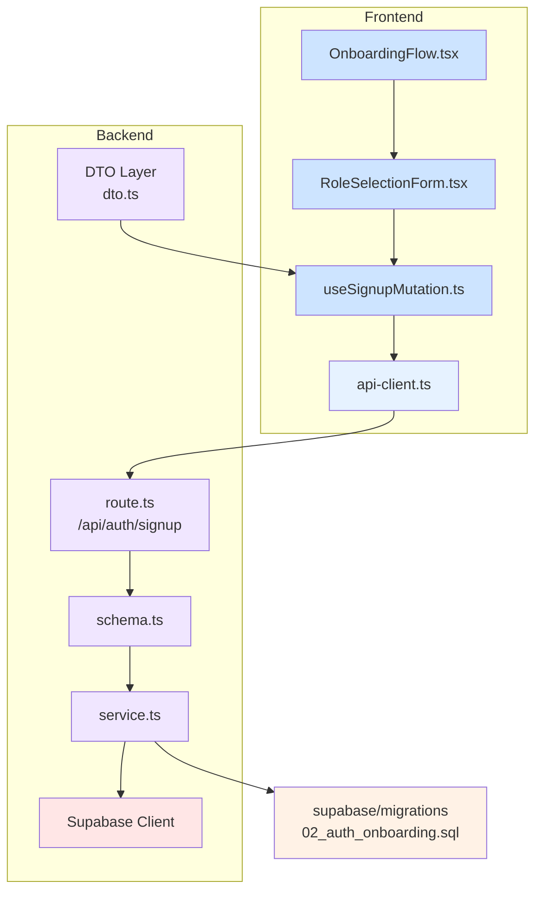

# 역할 선택 & 온보딩 모듈화 설계

## 개요

역할 선택 & 온보딩 기능을 구현하기 위한 최소한의 모듈화 설계입니다. AGENTS.md의 디렉토리 구조를 준수하여 모듈을 구성합니다.

### 프론트엔드 모듈

- **Presentation Layer (`src/features/auth/components`)**: 사용자 인터페이스 컴포넌트
  - `RoleSelectionForm.tsx`: 역할 선택 및 회원가입 폼
  - `OnboardingFlow.tsx`: 온보딩 프로세스를 관리하는 상위 컴포넌트
- **Hook Layer (`src/features/auth/hooks`)**: 프론트엔드 상태 관리 및 API 연동
  - `useSignupMutation.ts`: 회원가입 API 호출을 위한 React Query mutation hook

### 백엔드 모듈

- **Schema Layer (`src/features/auth/backend/schema.ts`)**: 요청/응답 데이터 검증 스키마
  - 회원가입 요청 스키마
  - 회원가입 응답 스키마
- **Service Layer (`src/features/auth/backend/service.ts`)**: 비즈니스 로직 및 Supabase 연동
  - `signupUserService`: 사용자 등록 비즈니스 로직
  - `createUserProfile`: 사용자 프로필 생성 로직
  - `recordTermsAgreement`: 약관 동의 기록 로직
- **Route Layer (`src/features/auth/backend/route.ts`)**: API 엔드포인트 정의
  - `/api/auth/signup` POST 엔드포인트
- **DTO Layer (`src/features/auth/lib/dto.ts`)**: 프론트엔드에서 사용할 응답 타입 정의

### 공통 모듈

- **Migration (`supabase/migrations`)**: 데이터베이스 스키마 정의
  - `02_auth_onboarding.sql`: `users` 및 `user_terms_agreement` 테이블 생성/수정

## Diagram

## Implementation Plan

### 1. Migration

- `supabase/migrations/02_auth_onboarding.sql` 파일 생성
- `users` 테이블에 `role`, `name`, `phone` 컬럼 존재 여부 확인 (이미 존재하므로 추가 불필요)
- `user_terms_agreement` 테이블에 필요한 인덱스 추가

### 2. Backend Schema

- `src/features/auth/backend/schema.ts` 파일 생성
- `signupRequestSchema`: 이메일, 비밀번호, 역할, 이름, 전화번호, 약관동의 여부 검증
- `signupResponseSchema`: 사용자 정보 및 리다이렉션 경로 반환

### 3. Backend Service

- `src/features/auth/backend/service.ts` 파일 생성
- `signupUserService` 함수: 사용자 정보 검증 → Supabase Auth 계정 생성 → 프로필 저장 → 약관 동의 기록 → 토큰 발급
- `createUserProfile` 함수: `users` 테이블에 사용자 프로필 저장
- `recordTermsAgreement` 함수: `user_terms_agreement` 테이블에 약관 동의 이력 저장
- 유닛 테스트 작성

### 4. Backend Route

- `src/features/auth/backend/route.ts` 파일 생성
- `registerAuthRoutes` 함수: `/api/auth/signup` 라우트 등록
- `createHonoApp`에 라우트 등록 추가

### 5. Backend DTO

- `src/features/auth/lib/dto.ts` 파일 생성
- 프론트엔드에서 사용할 응답 타입 정의

### 6. Frontend Hook

- `src/features/auth/hooks/useSignupMutation.ts` 파일 생성
- `@tanstack/react-query`의 `useMutation` 사용
- `api-client.ts`를 통해 `/api/auth/signup` 호출
- API 응답 타입은 DTO 사용

### 7. Frontend Components

- `src/features/auth/components/RoleSelectionForm.tsx` 파일 생성
- `react-hook-form` 사용하여 폼 관리
- 필수 입력 항목 및 유효성 검사
- `useSignupMutation` 호출
- Q&A 시트 작성