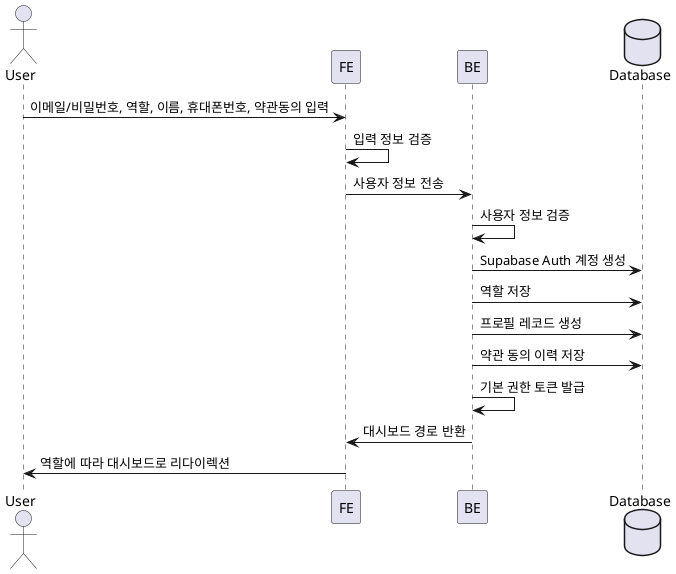

# Use Case Spec - 역할 선택 & 온보딩

## 1. Primary Actor
- 사용자 (User)

## 2. Precondition
- 사용자는 이메일과 비밀번호를 보유하고 있다.
- 사용자는 자신의 역할(Learner/Instructor)을 선택할 수 있다.
- 사용자는 필수 프로필 정보(이름, 휴대폰번호)를 제공할 수 있다.
- 사용자는 약관에 동의할 수 있다.

## 3. Trigger
- 사용자가 회원가입 폼에 이메일/비밀번호를 입력하고 역할을 선택한 후, 가입 버튼을 클릭한다.

## 4. Main Scenario
1. 사용자가 이메일/비밀번호, 역할(Learner/Instructor), 이름, 휴대폰번호, 약관동의 정보를 입력한다.
2. 프론트엔드는 입력된 정보를 검증한다.
3. 프론트엔드는 사용자의 정보를 백엔드 API에 전송한다.
4. 백엔드는 사용자 정보를 검증한 후, Supabase Auth에 계정을 생성한다.
5. 백엔드는 사용자의 역할을 저장한다.
6. 백엔드는 사용자의 프로필 레코드를 생성한다.
7. 백엔드는 약관 동의 이력을 저장한다.
8. 백엔드는 기본 권한 토큰을 발급한다.
9. 백엔드는 응답으로 적절한 대시보드 경로를 반환한다.
10. 프론트엔드는 사용자의 역할에 따라 Learner 코스 카탈로그 또는 Instructor 대시보드로 리다이렉션한다.

## 5. Edge Cases
- 이메일 형식이 잘못된 경우: 프론트엔드에서 입력 검증 실패
- 이미 존재하는 이메일인 경우: 백엔드에서 계정 생성 실패
- 필수 정보 누락: 프론트엔드에서 입력 검증 실패
- 약관 미동의: 프론트엔드에서 입력 검증 실패
- 서버 오류 발생: 알 수 없는 오류 메시지 표시

## 6. Business Rules
- 이메일은 중복될 수 없다.
- 역할은 Learner 또는 Instructor 중 하나만 선택할 수 있다.
- 이름과 휴대폰번호는 필수 입력 항목이다.
- 약관 동의는 필수이다.

## 7. Sequence Diagram

