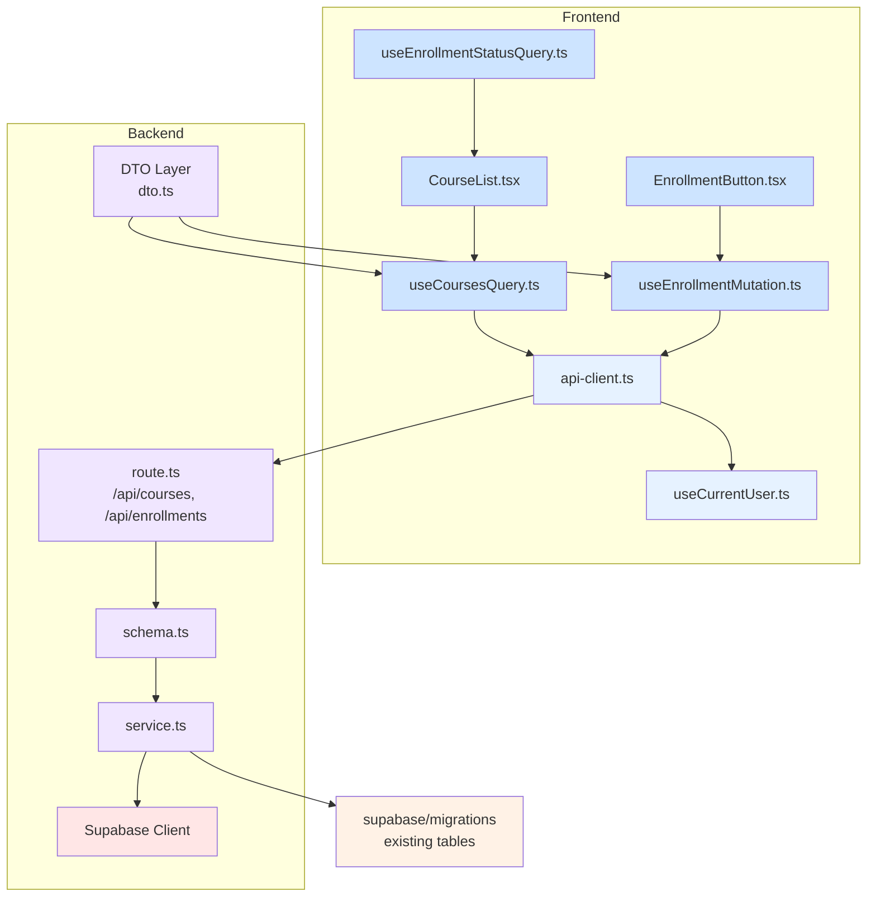

# 코스 탐색 & 수강신청/취소 모듈화 설계

## 개요

Learner의 코스 탐색 및 수강신청/취소 기능을 위한 최소한의 모듈화 설계입니다. AGENTS.md의 디렉토리 구조를 준수하여 모듈을 구성합니다.

### 프론트엔드 모듈

- **Presentation Layer (`src/features/course/components`)**: 사용자 인터페이스 컴포넌트
  - `CourseList.tsx`: 공개된 코스 목록 표시, 검색/필터링 UI
  - `CourseCard.tsx`: 개별 코스 카드 컴포넌트
  - `EnrollmentButton.tsx`: 수강신청/수강취소 버튼 컴포넌트
- **Hook Layer (`src/features/course/hooks`)**: 프론트엔드 상태 관리 및 API 연동
  - `useCoursesQuery.ts`: 공개 코스 목록 조회를 위한 React Query hook
  - `useEnrollmentMutation.ts`: 수강신청/수강취소 API 호출을 위한 React Query mutation hook
  - `useEnrollmentStatusQuery.ts`: 사용자 수강 상태 확인을 위한 React Query hook

### 백엔드 모듈

- **Schema Layer (`src/features/course/backend/schema.ts`)**: 요청/응답 데이터 검증 스키마
  - 코스 조회 요청 스키마 (검색어, 필터, 정렬 등)
  - 코스 응답 스키마
  - 수강신청 요청 스키마
  - 수강신청 응답 스키마
- **Service Layer (`src/features/course/backend/service.ts`)**: 비즈니스 로직 및 Supabase 연동
  - `getPublishedCoursesService`: 공개된 코스 목록 조회 및 필터링 비즈니스 로직
  - `createEnrollmentService`: 수강신청 비즈니스 로직 (중복 검사, 상태 검사 등)
  - `cancelEnrollmentService`: 수강취소 비즈니스 로직
- **Route Layer (`src/features/course/backend/route.ts`)**: API 엔드포인트 정의
  - `/api/courses` GET 엔드포인트 (필터링 포함)
  - `/api/enrollments` POST 엔드포인트
  - `/api/enrollments/:id` DELETE 엔드포인트
- **DTO Layer (`src/features/course/lib/dto.ts`)**: 프론트엔드에서 사용할 응답 타입 정의

## Diagram

## Implementation Plan

### 1. Backend Schema

- `src/features/course/backend/schema.ts` 파일 생성
- `getPublishedCoursesRequestSchema`: 검색어, 카테고리 ID, 난이도 ID, 정렬 옵션 검증
- `getPublishedCoursesResponseSchema`: 코스 목록 응답 스키마
- `createEnrollmentRequestSchema`: 코스 ID 검증
- `createEnrollmentResponseSchema`: 수강신청 응답 스키마
- `cancelEnrollmentResponseSchema`: 수강취소 응답 스키마

### 2. Backend Service

- `src/features/course/backend/service.ts` 파일 생성
- `getPublishedCoursesService` 함수: 조건에 따라 공개된 코스 목록 조회
- `createEnrollmentService` 함수: 수강신청 검증 및 생성 로직
  - 코스 상태 검증 (published 상태 검사)
  - 중복 수강 검사
  - 수강 신청 기록 생성
- `cancelEnrollmentService` 함수: 수강취소 검증 및 상태 변경 로직
  - 수강 상태 검증 (active 상태여야 취소 가능)
  - 수강 취소 상태로 업데이트
- 유닛 테스트 작성

### 3. Backend Route

- `src/features/course/backend/route.ts` 파일 생성
- `registerCourseRoutes` 함수: `/api/courses`, `/api/enrollments` 라우트 등록
- `createHonoApp`에 라우트 등록 추가
- 인증 및 권한 검사 미들웨어 적용

### 4. Backend DTO

- `src/features/course/lib/dto.ts` 파일 생성
- 프론트엔드에서 사용할 코스 및 수강 관련 응답 타입 정의

### 5. Frontend Hook

- `src/features/course/hooks/useCoursesQuery.ts` 파일 생성
- `@tanstack/react-query`의 `useQuery` 사용
- `api-client.ts`를 통해 `/api/courses` 호출
- API 응답 타입은 DTO 사용
- 쿼리 키: `['courses', filters]`

- `src/features/course/hooks/useEnrollmentMutation.ts` 파일 생성
- `@tanstack/react-query`의 `useMutation` 사용
- `api-client.ts`를 통해 `/api/enrollments` 호출
- 수강신청/취소 mutation 함수 구현

- `src/features/course/hooks/useEnrollmentStatusQuery.ts` 파일 생성
- 특정 코스에 대한 사용자의 수강 상태 확인 (isEnrolled)

### 6. Frontend Components

- `src/features/course/components/CourseList.tsx` 파일 생성
- `react-query`를 사용하여 코스 목록 가져오기
- 검색/필터링 UI 구현
- 코스 카드 목록 표시

- `src/features/course/components/CourseCard.tsx` 파일 생성
- 개별 코스 정보 표시
- 수강 신청 상태 표시
- 수강 버튼 포함

- `src/features/course/components/EnrollmentButton.tsx` 파일 생성
- 수강신청/수강취소 로직 구현
- 수강 상태에 따라 버튼 텍스트/동작 변경
- `useEnrollmentMutation` 사용
- Q&A 시트 작성