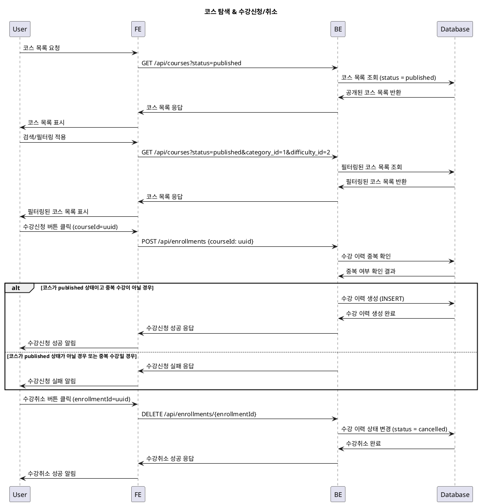

# 코스 탐색 & 수강신청/취소 기능 상세 명세서

## 1. 기능 개요
학습자가 코스를 탐색하고 수강신청 또는 수강취소를 할 수 있는 기능입니다.

## 2. 유스케이스 명세

### 유스케이스명
코스 탐색 & 수강신청/취소 (Learner)

### Primary Actor
Learner (학습자)

### Precondition (사용자 관점에서만)
- 사용자는 로그인 상태이어야 합니다.
- 사용자는 학습자(Learner) 역할을 가지고 있어야 합니다.

### Trigger
- 사용자가 코스 탐색 페이지에 접근하거나
- 사용자가 코스 목록을 검색/필터링하거나
- 사용자가 수강신청 또는 수강취소 버튼을 클릭합니다.

### Main Scenario

#### 수강신청 시나리오:
1. 사용자가 코스 목록 페이지를 요청합니다.
2. 시스템은 공개된 코스(published 상태) 목록을 보여줍니다.
3. 사용자가 검색어, 필터(카테고리, 난이도), 정렬 기준을 적용합니다.
4. 시스템은 조건에 맞는 코스 목록을 다시 표시합니다.
5. 사용자가 특정 코스 상세 페이지로 이동합니다.
6. 시스템은 코스 상세 정보를 보여줍니다.
7. 사용자가 "수강신청" 버튼을 클릭합니다.
8. 시스템은 다음과 같은 검증을 수행합니다:
   - 코스가 published 상태인지 확인
   - 사용자가 이미 수강신청한 코스인지 확인
9. 모든 검증이 통과되면, 시스템은 `enrollments` 테이블에 수강 신청 기록을 생성합니다.
10. 시스템은 수강신청 성공 메시지를 사용자에게 표시합니다.
11. 사용자의 대시보드 및 내 코스 목록이 업데이트됩니다.

#### 수강취소 시나리오:
1. 사용자가 내 코스 목록에서 특정 코스를 선택합니다.
2. 사용자가 "수강취소" 버튼을 클릭합니다.
3. 시스템은 수강취소 가능 여부를 검증합니다.
4. 검증이 통과되면, 시스템은 `enrollments` 테이블의 해당 기록 상태를 'cancelled'로 변경합니다.
5. 시스템은 수강취소 성공 메시지를 사용자에게 표시합니다.
6. 사용자의 대시보드 및 내 코스 목록에서 해당 코스가 제거됩니다.

### Edge Cases
- 코스가 published 상태가 아닌 경우: 수강신청이 불가능하며 오류 메시지를 표시합니다.
- 중복 수강 신청 시도: 이미 수강 중인 코스에 대해 중복 신청을 차단하고 알림을 표시합니다.
- 수강 정원 초과 시도: 정원이 초과된 코스에 대한 수강신청은 차단됩니다. (추후 구현)
- 네트워크 오류 발생: 수강신청/취소 요청 실패 시 재시도 유도 또는 오류 안내를 제공합니다.
- 데이터베이스 연결 실패: 시스템 장애 발생 시 사용자에게 적절한 오류 메시지를 표시합니다.

### Business Rules
- 코스 상태가 `published`인 경우에만 수강신청이 가능합니다.
- 하나의 사용자는 동일한 코스에 대해 중복 수강신청이 불가능합니다. 
- 수강취소 시 해당 코스의 성적 집계에서 제외됩니다.
- 수강취소한 코스는 대시보드의 내 코스 목록에서 제거됩니다.
- `enrollments` 테이블은 사용자 ID와 코스 ID의 조합에 대해 유니크 제약조건을 가집니다.

## 3. 시퀀스 다이어그램

