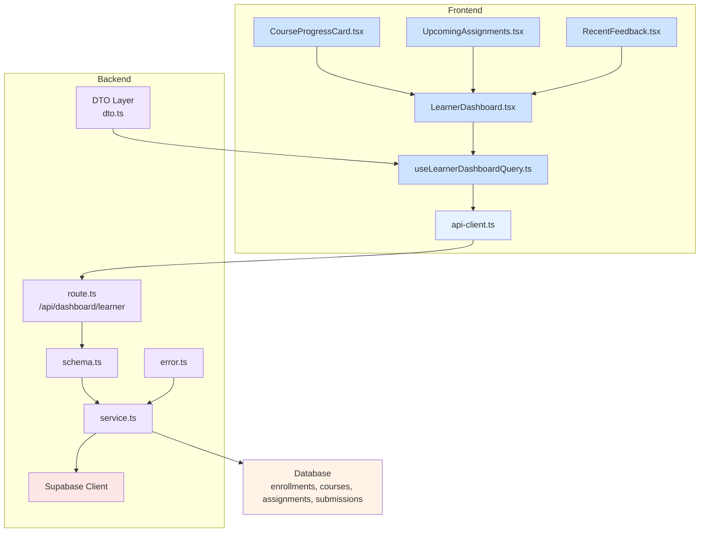

# Learner Dashboard 모듈화 설계

## 개요

Learner Dashboard 기능을 구현하기 위한 최소한의 모듈화 설계입니다. AGENTS.md의 디렉토리 구조를 준수하여 모듈을 구성합니다.

### 프론트엔드 모듈

- **Presentation Layer (`src/features/dashboard/components`)**: 사용자 인터페이스 컴포넌트
  - `LearnerDashboard.tsx`: 대시보드 전체 레이아웃을 관리하는 상위 컴포넌트
  - `CourseProgressCard.tsx`: 강의별 진행률을 표시하는 카드 컴포넌트
  - `UpcomingAssignments.tsx`: 과제 마감일을 표시하는 컴포넌트
  - `RecentFeedback.tsx`: 최근 피드백 요약을 표시하는 컴포넌트
- **Hook Layer (`src/features/dashboard/hooks`)**: 프론트엔드 상태 관리 및 API 연동
  - `useLearnerDashboardQuery.ts`: 대시보드 API 호출을 위한 React Query query hook

### 백엔드 모듈

- **Schema Layer (`src/features/dashboard/backend/schema.ts`)**: 요청/응답 데이터 검증 스키마
  - 대시보드 요청 스키마
  - 대시보드 응답 스키마 (강의 목록, 진행률, 과제 정보, 피드백 요약 포함)
- **Service Layer (`src/features/dashboard/backend/service.ts`)**: 비즈니스 로직 및 Supabase 연동
  - `getLearnerDashboardService`: 학습자 대시보드 정보 가져오기 비즈니스 로직
  - `calculateCourseProgress`: 강의별 진행률 계산 로직
- **Route Layer (`src/features/dashboard/backend/route.ts`)**: API 엔드포인트 정의
  - `/api/dashboard/learner` GET 엔드포인트
- **Error Layer (`src/features/dashboard/backend/error.ts`)**: 대시보드 관련 에러 코드 정의
- **DTO Layer (`src/features/dashboard/lib/dto.ts`)**: 프론트엔드에서 사용할 응답 타입 정의

## Diagram

## Implementation Plan

### 1. Backend Schema

- `src/features/dashboard/backend/schema.ts` 파일 생성
- `learnerDashboardResponseSchema`: 강의 목록, 진행률, 마감 임박 과제, 최근 피드백 정보 포함
- 각 하위 스키마 정의 (CourseProgress, AssignmentInfo, FeedbackSummary 등)

### 2. Backend Service

- `src/features/dashboard/backend/service.ts` 파일 생성
- `getLearnerDashboardService` 함수: 로그인한 사용자의 ID를 기반으로 대시보드 정보 조회
- `calculateCourseProgress` 함수: 강의별 진행률 계산 (제출된 과제 중 채점된 과제 수 / 전체 과제 수)
- 유닛 테스트 작성 (`service.test.ts`)

### 3. Backend Error

- `src/features/dashboard/backend/error.ts` 파일 생성
- 대시보드 관련 에러 코드 정의 (예: DASHBOARD_FETCH_ERROR, USER_NOT_FOUND 등)

### 4. Backend Route

- `src/features/dashboard/backend/route.ts` 파일 생성
- `registerDashboardRoutes` 함수: `/api/dashboard/learner` 라우트 등록
- `createHonoApp`에 라우트 등록 추가

### 5. Backend DTO

- `src/features/dashboard/lib/dto.ts` 파일 생성
- 프론트엔드에서 사용할 응답 타입 정의

### 6. Frontend Hook

- `src/features/dashboard/hooks/useLearnerDashboardQuery.ts` 파일 생성
- `@tanstack/react-query`의 `useQuery` 사용
- `api-client.ts`를 통해 `/api/dashboard/learner` 호출
- API 응답 타입은 DTO 사용

### 7. Frontend Components

- `src/features/dashboard/components/LearnerDashboard.tsx` 파일 생성
- 대시보드 레이아웃 구성
- `useLearnerDashboardQuery` 사용하여 데이터 로드
- 하위 컴포넌트들 조합

- `src/features/dashboard/components/CourseProgressCard.tsx` 파일 생성
- 강의 진행률 시각화

- `src/features/dashboard/components/UpcomingAssignments.tsx` 파일 생성
- 마감 임박 과제 표시

- `src/features/dashboard/components/RecentFeedback.tsx` 파일 생성
- 최근 피드백 요약 표시

### 8. Frontend Integration

- 기존의 `/src/app/(protected)/dashboard/page.tsx` 파일 업데이트
- 기존 내용 대신 새로운 `LearnerDashboard` 컴포넌트 사용

### 9. Route Registration

- `src/backend/hono/app.ts` 파일 수정
- `registerDashboardRoutes` 함수 import 및 등록
- Q&A 시트 작성