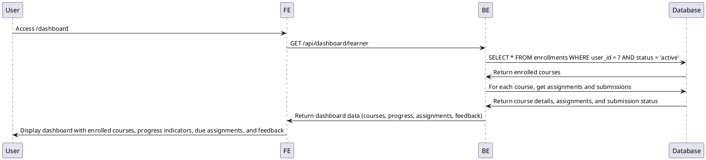

# Use Case Specification: Learner Dashboard

## Primary Actor
- Learner (Authenticated User with role='learner')

## Precondition
- User has successfully authenticated and has a valid session token
- User's account role is confirmed as 'learner' in the database
- User has completed the onboarding process (profile information registered)

## Trigger
- Learner accesses the `/dashboard` route or clicks on the 'Dashboard' navigation item

## Main Scenario
1. Learner accesses the learner dashboard page
2. System retrieves the authenticated user's ID from the session
3. System queries for enrolled courses (`enrollments` table where `user_id` matches and `status='active'`)
4. For each enrolled course, system calculates:
   - Progress ratio (completed assignments / total assignments)
   - Status of current assignments (due soon, overdue, submitted, graded)
5. System retrieves recent feedback summaries from `submissions` table
6. System displays:
   - Enrolled courses with progress indicators
   - Upcoming assignments with due dates
   - Recent feedback notifications
   - Overall performance metrics

## Edge Cases
- **No enrolled courses**: Display message "No enrolled courses. Browse available courses to get started."
- **Database connection failure**: Show user-friendly error message "Dashboard temporarily unavailable. Please try again later."
- **Expired session token**: Redirect to login page with appropriate message
- **No recent activity**: Display "No recent activity" in relevant sections
- **Malformed user data**: System defaults to safe display options and logs error

## Business Rules
- Only shows courses where enrollment status is 'active'
- Progress is calculated as: (submitted assignments with status 'graded') / (total published assignments in course)
- "Due soon" assignments are those due within 3 days
- Assignments past due date but still submit-able (with late policy) are displayed as "Overdue"
- Each user can only access their own dashboard data
- Dashboard refreshes real-time when assignment submissions are made (via optimistic updates)

## Sequence Diagram

