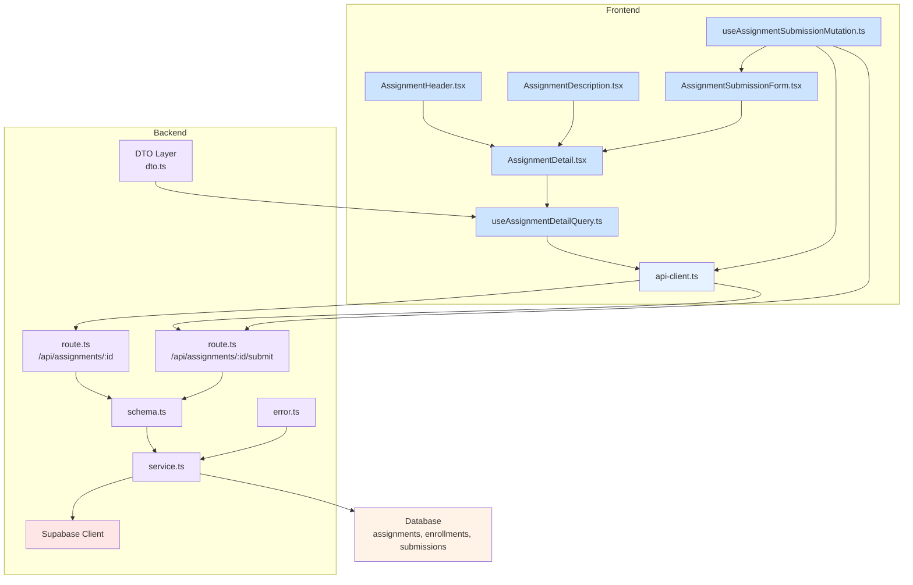

# Assignment Detail View (Learner) Implementation Plan

## Overview

This document outlines the implementation plan for the Assignment Detail View feature for Learners. The feature allows learners to view detailed information about assignments in their enrolled courses and submit their work if the assignment is open for submissions.

### Frontend Modules

- **Presentation Layer (`src/features/assignment/detail/components`)**: Assignment detail user interface components
  - `AssignmentDetail.tsx`: Main assignment detail layout component
  - `AssignmentHeader.tsx`: Displays assignment title, deadline, and score weight
  - `AssignmentDescription.tsx`: Shows assignment description and policies
  - `AssignmentSubmissionForm.tsx`: Submission form with text input and link input fields
- **Hook Layer (`src/features/assignment/detail/hooks`)**: Frontend state management and API integration
  - `useAssignmentDetailQuery.ts`: React Query hook for fetching assignment details
  - `useAssignmentSubmissionMutation.ts`: Mutation hook for submitting assignments
- **Lib Layer (`src/features/assignment/detail/lib`)**: Shared utilities and types
  - `validation.ts`: Zod schemas for assignment detail validation
  - `dto.ts`: TypeScript types for assignment detail responses

### Backend Modules

- **Schema Layer (`src/features/assignment/detail/backend/schema.ts`)**: Request/response data validation schemas
  - Assignment detail response schema
  - Assignment submission request schema
  - Assignment submission response schema
- **Service Layer (`src/features/assignment/detail/backend/service.ts`)**: Business logic and Supabase integration
  - `getAssignmentDetailService`: Fetch assignment details with validation
  - `submitAssignmentService`: Handle assignment submission business logic
  - Helper functions for assignment status validation
- **Route Layer (`src/features/assignment/detail/backend/route.ts`)**: API endpoint definitions
  - `/api/assignments/:id` GET endpoint for fetching assignment details
  - `/api/assignments/:id/submit` POST endpoint for submitting assignments
- **Error Layer (`src/features/assignment/detail/backend/error.ts`)**: Assignment detail related error codes definition
- **DTO Layer (`src/features/assignment/detail/lib/dto.ts`)**: Response types for frontend consumption

## Diagram

## Implementation Plan

### 1. Backend Schema

- `src/features/assignment/detail/backend/schema.ts` 파일 생성
- `assignmentDetailResponseSchema`: Assignment title, description, deadline, score weight, submission policies 정보 포함
- `assignmentSubmissionRequestSchema`: Content (required), link (optional) 필드 정의
- `assignmentSubmissionResponseSchema`: Submission result 정보 정의
- 각 하위 스키마 정의 (AssignmentDetail, SubmissionPolicy 등)

### 2. Backend Service

- `src/features/assignment/detail/backend/service.ts` 파일 생성
- `getAssignmentDetailService` 함수: 로그인한 사용자의 ID를 기반으로 과제 상세 정보 조회
- `submitAssignmentService` 함수: 과제 제출 처리 로직 구현
- Assignment status validation helper functions: 과제 상태 확인 및 접근 권한 검증
- 유닛 테스트 작성 (`service.test.ts`)

### 3. Backend Error

- `src/features/assignment/detail/backend/error.ts` 파일 생성
- 과제 상세 관련 에러 코드 정의 (예: ASSIGNMENT_NOT_FOUND, ASSIGNMENT_NOT_PUBLISHED, INSUFFICIENT_PERMISSIONS 등)

### 4. Backend Route

- `src/features/assignment/detail/backend/route.ts` 파일 생성
- `registerAssignmentDetailRoutes` 함수: `/api/assignments/:id` 및 `/api/assignments/:id/submit` 라우트 등록
- `createHonoApp`에 라우트 등록 추가

### 5. Backend DTO

- `src/features/assignment/detail/lib/dto.ts` 파일 생성
- 프론트엔드에서 사용할 응답 타입 정의 (AssignmentDetail, SubmissionResponse 등)

### 6. Frontend Hook

- `src/features/assignment/detail/hooks/useAssignmentDetailQuery.ts` 파일 생성
- `@tanstack/react-query`의 `useQuery` 사용
- `api-client.ts`를 통해 `/api/assignments/:id` 호출
- API 응답 타입은 DTO 사용

- `src/features/assignment/detail/hooks/useAssignmentSubmissionMutation.ts` 파일 생성
- `@tanstack/react-query`의 `useMutation` 사용
- `api-client.ts`를 통해 `/api/assignments/:id/submit` 호출
- 제출 결과에 따른 상태 관리

### 7. Frontend Components

- `src/features/assignment/detail/components/AssignmentDetail.tsx` 파일 생성
- 과제 상세 레이아웃 구성
- `useAssignmentDetailQuery` 사용하여 데이터 로드
- 하위 컴포넌트들 조합

- `src/features/assignment/detail/components/AssignmentHeader.tsx` 파일 생성
- 과제 제목, 마감일, 점수 비중 표시

- `src/features/assignment/detail/components/AssignmentDescription.tsx` 파일 생성
- 과제 설명 및 제출 정책 표시

- `src/features/assignment/detail/components/AssignmentSubmissionForm.tsx` 파일 생성
- 텍스트 입력 필드, 링크 입력 필드, 제출 버튼 포함
- `useAssignmentSubmissionMutation` 사용하여 제출 처리

### 8. Frontend Validation

- `src/features/assignment/detail/lib/validation.ts` 파일 생성
- Zod를 사용한 제출 폼 유효성 검사 스키마 정의
- 텍스트 필드 필수 입력 검증
- 링크 필드 URL 형식 검증

### 9. Frontend Integration

- 새로운 페이지 경로 `/src/app/(protected)/courses/[courseId]/assignments/[assignmentId]/page.tsx` 생성
- 기존에 없는 경우 courseId 파라미터도 함께 처리
- 새로운 `AssignmentDetail` 컴포넌트 사용

### 10. Route Registration

- `src/backend/hono/app.ts` 파일 수정
- `registerAssignmentDetailRoutes` 함수 import 및 등록

### 11. Navigation Integration

- 기존의 과제 목록 UI (대시보드 또는 코스 상세)에 과제 상세 페이지로 이동하는 링크 추가
- 과제 카드/리스트 아이템에 클릭 시 상세 페이지로 이동하는 로직 구현

### 12. Testing

- Frontend 컴포넌트 유닛 테스트 작성
- Backend 서비스 로직 테스트 작성
- API 엔드포인트 통합 테스트 작성
- 인증/권한 검증 테스트 포함