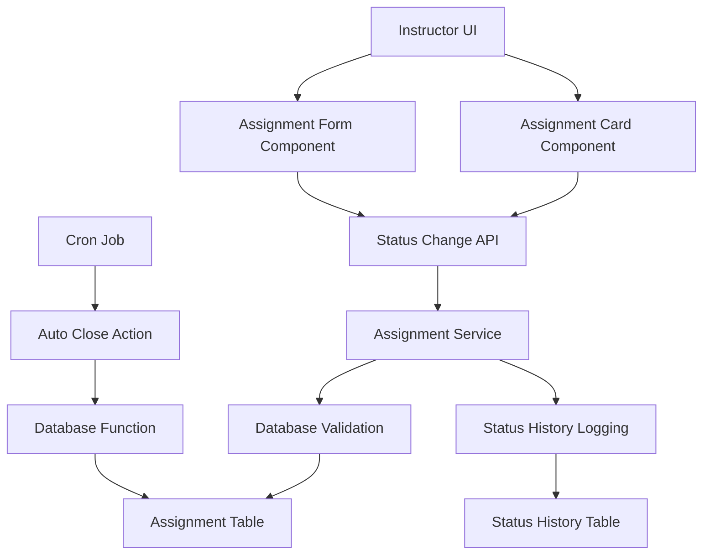

# Implementation Plan: Assignment Publishing/Closing Feature

## Overview
This document outlines the implementation plan for the Assignment Publishing/Closing feature for Instructors, based on the specification in `/docs/011/spec.md`. The feature allows instructors to publish assignments from draft state and close published assignments manually, with additional auto-closing functionality.

## Current State Analysis
Based on codebase analysis, there's already partial implementation for assignment publishing/closing:
- `/src/features/assignment/management/backend/service.ts` - Contains `updateAssignmentStatusService` function
- `/src/features/assignment/management/backend/route.ts` - Contains PUT `/assignments/:id/status` endpoint
- `/src/features/assignment/management/components/assignment-card.tsx` - Contains UI for status change
- `/src/features/assignment/management/actions/close-assignments.ts` - Contains auto-closing action
- Database schema already supports status changes with `status`, `published_at`, and `closed_at` fields

However, the current implementation needs enhancements to fully match the specification requirements, particularly around validation, error handling, and UI feedback.

## Implementation Plan

### Phase 1: Backend Implementation

#### 1.1 Enhance Backend Service for Status Validation
Location: `/src/features/assignment/management/backend/service.ts`

**Enhance `updateAssignmentStatusService` with:**
- More comprehensive validation for status transitions (draft→published, published→closed)
- Validation for required fields before publishing
- Check for past deadline when publishing
- Enhanced error handling with proper error codes

#### 1.2 Update Backend Error Handling
Location: `/src/features/assignment/management/backend/error.ts`

**Add error codes for:**
- `INVALID_STATUS_TRANSITION`: For invalid status changes
- `MISSING_REQUIRED_FIELD`: For incomplete assignment fields when publishing
- `INVALID_DEADLINE`: For attempting to publish assignment with past deadline

#### 1.3 Create Cron Job for Auto-Closing Assignments
Location: `/src/features/assignment/management/actions/close-assignments.ts`

**Enhance `closePastDeadlineAssignments` with:**
- Better logging for audit trail
- Return detailed results of the operation
- Add validation for the cron job execution

### Phase 2: Frontend Implementation

#### 2.1 Create Status Change Confirmation Dialog Component
Location: `/src/features/assignment/management/components/status-change-dialog.tsx`

**Features to implement:**
- Confirmation dialog for status changes
- Different messages based on status transition
- Validation warnings before publishing
- Loading states
- Error handling

#### 2.2 Update Assignment Card Component
Location: `/src/features/assignment/management/components/assignment-card.tsx`

**Enhancements to implement:**
- Integrate status change confirmation dialog
- Add validation feedback for publishing
- Show deadline warnings when appropriate
- Improve UX for status change operations

#### 2.3 Create Assignment Status Indicator Component
Location: `/src/features/assignment/management/components/status-indicator.tsx`

**Features to implement:**
- Visual indicator showing current assignment state
- Additional details like publish/close timestamps
- Color-coded indicators for different states

#### 2.4 Update Assignment Form Component
Location: `/src/features/assignment/management/components/assignment-form.tsx`

**Enhancements to implement:**
- Add validation for required fields before publishing
- Show deadline warnings when deadline is in the past
- Add status change history display
- Improve validation error messages

#### 2.5 Create Assignment Status History Component
Location: `/src/features/assignment/management/components/status-history.tsx`

**Features to implement:**
- Display status change history
- Show timestamps and who made the changes
- Audit trail for status changes

### Phase 3: Integration and Testing

#### 3.1 Update API Endpoints
Location: `/src/features/assignment/management/backend/route.ts`

**Enhancements to implement:**
- Add proper validation for status transitions
- Include detailed error responses
- Add logging for status changes

#### 3.2 Update Assignment Management Page
Location: `/src/app/courses/[courseId]/assignments/page.tsx`

**Features to implement:**
- Show status change indicators
- Add bulk status change functionality
- Display validation warnings

#### 3.3 Create Status Change History API
Location: `/src/features/assignment/management/backend/route.ts`

**Add endpoint for:**
- GET `/api/assignments/:id/status-history` - Get status change history for audit trail

## Technical Considerations

### Security
- Ensure only course owners can change assignment status
- Validate user permissions at both API and UI levels
- Implement proper authentication using existing middleware
- Validate assignment ownership before allowing status changes

### Data Integrity
- Use database transactions for status change operations
- Ensure status validation at both API and database levels
- Maintain audit trail for status changes (future enhancement)

### Performance
- Implement proper indexing for status queries
- Optimize database queries to minimize round trips
- Consider caching for frequently accessed status data

### Error Handling
- Provide clear error messages to users
- Log errors appropriately for debugging
- Handle edge cases like concurrent status changes

## Dependencies
- Supabase client for database operations
- Zod for input validation
- Hono for API routing
- React Hook Form for form management
- Existing authentication middleware

## Diagram

## Modules Overview

### Frontend Modules
- `status-change-dialog.tsx`: Confirmation dialog for status changes
- `status-indicator.tsx`: Visual indicator for assignment status
- `status-history.tsx`: Component to display status change history
- Enhanced `assignment-card.tsx`: Assignment card with improved status handling
- Enhanced `assignment-form.tsx`: Assignment form with validation

### Backend Modules
- Enhanced `service.ts`: Assignment service with improved status validation
- Enhanced `route.ts`: API routes with proper error handling
- Enhanced `error.ts`: Error definitions for status transitions
- `close-assignments.ts`: Server action for auto-closing assignments
- New `status-history-service.ts`: Service for managing status history

### Shared Modules
- Enhanced `schemas.ts`: Updated validation schemas
- Database functions and triggers for auto-closing

## Implementation Steps

### Step 1: Backend Service Enhancement
1. Update `updateAssignmentStatusService` in `/src/features/assignment/management/backend/service.ts`
2. Add comprehensive validation for status transitions
3. Implement required field validation before publishing
4. Add proper error handling with new error codes

### Step 2: Backend Error Handling
1. Update `/src/features/assignment/management/backend/error.ts` with new error codes
2. Define error messages for different failure scenarios
3. Include business rule violations in error definitions

### Step 3: Backend API Enhancement
1. Update `/src/features/assignment/management/backend/route.ts` with enhanced validation
2. Add proper response formatting for status changes
3. Include detailed error responses

### Step 4: Frontend Components
1. Create `/src/features/assignment/management/components/status-change-dialog.tsx`
2. Create `/src/features/assignment/management/components/status-indicator.tsx`
3. Create `/src/features/assignment/management/components/status-history.tsx`
4. Enhance existing components with new functionality

### Step 5: Frontend Integration
1. Update assignment management page with new components
2. Add status change history API endpoint
3. Implement proper loading and error states

### Step 6: Auto-Closing Enhancement
1. Enhance `/src/features/assignment/management/actions/close-assignments.ts`
2. Add proper logging and audit trail
3. Test cron job functionality

### Step 7: Testing
1. Unit test service functions
2. Integration test API endpoints
3. Component tests for UI elements
4. End-to-end test the complete status change flow

## Testing Strategy
1. Unit tests for service functions
2. Integration tests for API endpoints
3. Component tests for UI elements
4. End-to-end tests for complete user flows
5. Edge case testing for invalid status transitions and permissions
6. Test auto-closing functionality with various deadline scenarios