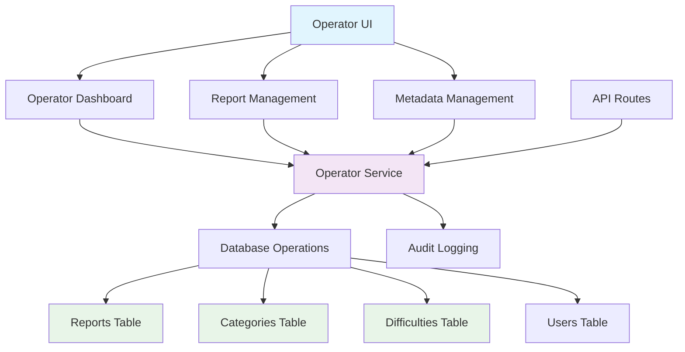

# Implementation Plan: Operation (Operator) Feature

## Overview
This document outlines the implementation plan for the Operation (Operator) feature for system administrators, based on the specification in `/docs/012/spec.md`. The feature allows operators to manage reports a nd system metadata (categories and difficulty levels).

## Current State Analysis
Based on codebase analysis:
- Database schema already includes `reports` table and `is_active` columns in `categories` and `difficulties` tables
- User roles already support 'operator' role in the database
- Auth middleware supports role-based access control
- The `/src/features/operator` directory exists but is empty
- No existing report handling functionality in the frontend/backend

## Implementation Plan

### Phase 1: Backend Implementation

#### 1.1 Create Operator Backend Service
Location: `/src/features/operator/backend/service.ts`

**Functions to implement:**
- `getReportsService` - Fetch reports with filtering by type and status
- `updateReportStatusService` - Update report status (received → investigating → resolved)
- `takeReportActionService` - Handle administrative actions on reports
- `getMetadataService` - Fetch active/inactive metadata (categories/difficulties)
- `createMetadataService` - Create new metadata entries with `is_active = TRUE`
- `updateMetadataService` - Update existing metadata entries
- `deactivateMetadataService` - Set `is_active = FALSE` for metadata deactivation
- `logAdminActionService` - Log administrative actions for audit trail

#### 1.2 Create Operator Backend Schema
Location: `/src/features/operator/backend/schema.ts`

**Zod schemas to implement:**
- Report filtering schema
- Report status update schema
- Administrative action schema
- Metadata creation/update schema
- Input validation schemas for all operator operations

#### 1.3 Create Operator Backend Routes
Location: `/src/features/operator/backend/route.ts`

**API endpoints to implement:**
- `GET /api/operator/reports` - Get list of reports with filtering
- `GET /api/operator/reports/:id` - Get report details
- `PUT /api/operator/reports/:id/status` - Update report status
- `POST /api/operator/reports/:id/actions` - Take administrative action on report
- `GET /api/operator/categories` - Get categories with `is_active` status
- `POST /api/operator/categories` - Create new category
- `PUT /api/operator/categories/:id` - Update category
- `PUT /api/operator/categories/:id/deactivate` - Deactivate category
- `GET /api/operator/difficulties` - Get difficulties with `is_active` status
- `POST /api/operator/difficulties` - Create new difficulty
- `PUT /api/operator/difficulties/:id` - Update difficulty
- `PUT /api/operator/difficulties/:id/deactivate` - Deactivate difficulty

#### 1.4 Create Operator Backend Error Handling
Location: `/src/features/operator/backend/error.ts`

**Error codes to implement:**
- `REPORT_NOT_FOUND`: For invalid report IDs
- `INVALID_REPORT_STATUS_TRANSITION`: For invalid status changes
- `INVALID_ADMIN_ACTION`: For invalid administrative actions
- `METADATA_IN_USE`: For attempts to deactivate in-use metadata
- `OPERATOR_PERMISSION_DENIED`: For unauthorized access

### Phase 2: Frontend Implementation

#### 2.1 Create Operator Dashboard Components
Location: `/src/features/operator/components`

**Components to implement:**
- `OperatorDashboard.tsx` - Main dashboard with metrics and navigation
- `ReportManagement.tsx` - Report list and filtering interface
- `ReportDetail.tsx` - Detailed view of individual reports
- `ReportStatusChange.tsx` - UI for changing report status
- `AdminActionButtons.tsx` - Buttons for administrative actions
- `MetadataManagement.tsx` - Interface for managing categories/difficulties
- `CategoryManagement.tsx` - Category-specific management UI
- `DifficultyManagement.tsx` - Difficulty-specific management UI
- `MetadataForm.tsx` - Form for creating/updating metadata

#### 2.2 Create Operator Hooks
Location: `/src/features/operator/hooks`

**Hooks to implement:**
- `useReports` - Fetch and manage reports data
- `useReportActions` - Handle report status updates and actions
- `useMetadata` - Fetch and manage metadata (categories/difficulties)
- `useCategoryManagement` - Handle category operations
- `useDifficultyManagement` - Handle difficulty operations

#### 2.3 Create Operator Pages
Location: `/src/features/operator/pages`

**Pages to implement:**
- `operator-dashboard.tsx` - Main operator dashboard page
- `reports-list.tsx` - Page for viewing and managing reports
- `report-detail.tsx` - Page for viewing detailed report information
- `metadata-management.tsx` - Page for managing system metadata

### Phase 3: Integration and Testing

#### 3.1 Update Main Route Handler
Location: `/src/app/(main)/operator/*` routes

**Add routes for:**
- `/operator` - Operator dashboard
- `/operator/reports` - Report management
- `/operator/reports/[id]` - Report detail view
- `/operator/metadata` - Metadata management

#### 3.2 Create Unit Tests
Location: `/src/features/operator/backend/service.test.ts`

**Tests to implement:**
- Service function tests for all operator operations
- Error handling tests
- Permission validation tests
- Database transaction tests

#### 3.3 Create Component Tests
Location: `/src/features/operator/components/*/*.test.tsx`

**Tests to implement:**
- Component rendering tests
- User interaction tests
- API call tests with mocks

## Technical Considerations

### Security
- Ensure only users with operator role can access operator endpoints
- Validate user permissions at both API and UI levels
- Implement proper authentication using existing middleware
- Prevent unauthorized access to sensitive report information

### Data Integrity
- Use database transactions for report status changes
- Validate report status transitions (received → investigating → resolved)
- Implement soft deactivation for metadata (is_active = FALSE instead of DELETE)
- Preserve historical data when deactivating metadata

### Performance
- Implement proper indexing for report queries (by type, status, date)
- Optimize metadata queries with is_active filters
- Use pagination for large report lists
- Cache frequently accessed metadata

### Error Handling
- Provide clear error messages to operators
- Log all administrative actions for audit trail
- Handle edge cases like concurrent report processing
- Validate all input parameters

## Dependencies
- Supabase client for database operations
- Zod for input validation
- Hono for API routing
- React Hook Form for form management
- Existing authentication middleware
- Shared UI components and utilities

## Diagram

## Modules Overview

### Frontend Modules
- `components/OperatorDashboard.tsx`: Main operator dashboard UI
- `components/ReportManagement.tsx`: Report list and filtering interface
- `components/ReportDetail.tsx`: Detailed report view
- `components/MetadataManagement.tsx`: Metadata management interface
- `components/CategoryManagement.tsx`: Category-specific UI
- `components/DifficultyManagement.tsx`: Difficulty-specific UI
- `hooks/useReports.ts`: Report data management
- `hooks/useMetadata.ts`: Metadata data management
- `pages/operator-dashboard.tsx`: Dashboard page
- `pages/reports-list.tsx`: Report management page
- `pages/report-detail.tsx`: Report detail page
- `pages/metadata-management.tsx`: Metadata management page

### Backend Modules
- `backend/service.ts`: Core business logic for operator functions
- `backend/route.ts`: API endpoints for operator functionality
- `backend/schema.ts`: Input validation schemas
- `backend/error.ts`: Error definitions and handling
- `lib/audit-logger.ts`: Audit trail functionality

### Shared Modules
- Enhanced `schemas.ts`: Shared validation schemas
- Database functions for audit logging

## Implementation Steps

### Step 1: Backend Service Implementation
1. Create `/src/features/operator/backend/service.ts` with all required service functions
2. Implement report management functions with proper validation
3. Implement metadata management functions with soft deletion policy
4. Add audit logging for all administrative actions

### Step 2: Backend Schema and Error Handling
1. Create `/src/features/operator/backend/schema.ts` with validation schemas
2. Create `/src/features/operator/backend/error.ts` with error codes
3. Implement proper error responses in service functions

### Step 3: Backend API Routes
1. Create `/src/features/operator/backend/route.ts` with all required endpoints
2. Apply authentication and role-based authorization middleware
3. Connect routes to service functions

### Step 4: Frontend Components
1. Create basic dashboard component
2. Create report management components
3. Create metadata management components
4. Implement proper UI states and loading indicators

### Step 5: Frontend Hooks
1. Create data fetching hooks for reports
2. Create data fetching hooks for metadata
3. Implement mutation hooks for operator actions

### Step 6: Frontend Pages
1. Create operator dashboard page
2. Create report management page
3. Create metadata management page
4. Implement proper routing and navigation

### Step 7: Integration and Testing
1. Connect frontend to backend APIs
2. Implement comprehensive unit tests
3. Create component tests
4. Test role-based access control
5. Perform end-to-end testing of all operator workflows

### Step 8: UI/UX Enhancement
1. Add confirmation dialogs for destructive actions
2. Implement proper loading states
3. Add error boundaries and user-friendly error messages
4. Ensure responsive design for all operator interfaces

## Testing Strategy
1. Unit tests for all service functions
2. Integration tests for API endpoints
3. Component tests for UI elements
4. End-to-end tests for complete operator workflows
5. Security tests for role-based access control
6. Edge case testing for invalid status transitions and permissions
7. Data integrity tests for metadata deactivation policy