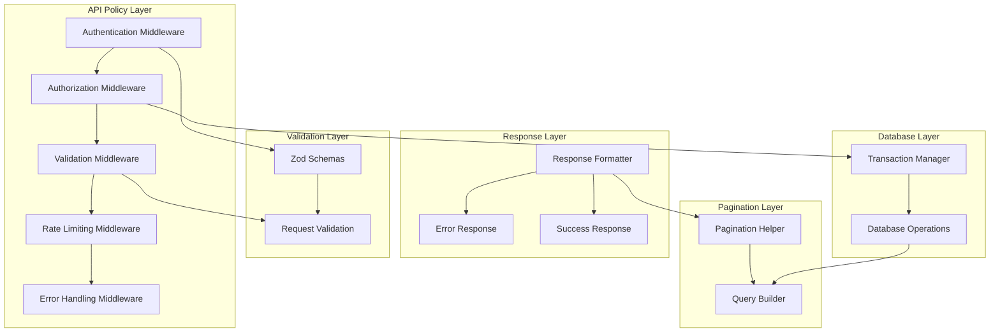

# API Policy Implementation Plan

## 1. 개요

이 문서는 smallLMS 프로젝트의 API 정책을 구현하기 위한 상세 계획입니다. 기존 `api-policy.md` 문서에 명시된 정책을 기반으로, 인증, 권한 부여, API 설계 원칙, 오류 처리, 페이지네이션, 트랜잭션 정책 등을 구현하는 데 필요한 모듈과 구조를 설계합니다.

## 2. 목표

- 기존 API 정책 문서의 요구사항을 코드로 구현
- 일관된 API 설계 원칙 유지
- 보안 강화를 위한 인증/권한 부여 정책 구현
- 오류 처리 및 로깅 시스템 구현
- 성능 최적화를 위한 페이지네이션 및 캐싱 전략 구현

## 3. 설계 원칙

- **DRY (Don't Repeat Yourself)**: 공통 기능은 공통 모듈로 분리
- **SRP (Single Responsibility Principle)**: 각 모듈은 단일 책임만 수행
- **Type Safety**: TypeScript 및 Zod를 통한 타입 안전성 보장
- **Consistency**: 일관된 API 응답 형식 및 오류 코드 체계 유지

## 4. 모듈 설계

### 4.1 인증 및 권한 부여 모듈

**위치**: `src/backend/middleware/auth.ts` (기존 파일 확장)

**기능**:
- JWT 토큰 검증 (Supabase 기반)
- 사용자 세션 관리
- 역할 기반 접근 제어 (RBAC)

**구현 계획**:
1. `requireAuth()` 미들웨어 구현
2. `requireRole()` 미들웨어 확장
3. `isAdmin()`, `isInstructor()`, `isLearner()` 역할 확인 함수 추가
4. 인증 실패 시 `401 Unauthorized` 응답 처리

### 4.2 API 응답 형식 모듈

**위치**: `src/backend/http/response.ts` (기존 파일 확장)

**기능**:
- 일관된 API 응답 형식 제공
- 성공/실패 응답 헬퍼 함수
- 오류 코드 및 메시지 정의

**구현 계획**:
1. `success()` 함수 확장 (pagination 지원 포함)
2. `failure()` 함수 오류 코드 체계 정의
3. `respond()` 함수 확장 (에러 로깅 포함)

### 4.3 Zod 스키마 검증 모듈

**위치**: `src/backend/validation/index.ts`

**기능**:
- 공통 Zod 스키마 정의
- 요청 파라미터 및 본문 검증
- 페이지네이션 스키마 정의

**구현 계획**:
1. 공통 스키마 정의 (UUID, pagination 등)
2. 검증 미들웨어 확장
3. API별 스키마 정의 가이드 문서 작성

### 4.4 API 정책 미들웨어 모듈

**위치**: `src/backend/middleware/policy.ts`

**기능**:
- 속도 제한 (Rate Limiting)
- 요청 검증
- 보안 정책 적용

**구현 계획**:
1. 속도 제한 미들웨어 구현 (IP 기반)
2. 요청 크기 제한
3. 허용된 HTTP 메서드 검사
4. CORS 정책 적용

### 4.5 에러 처리 및 로깅 모듈

**위치**: `src/backend/middleware/error.ts` (기존 파일 확장)

**기능**:
- 전역 오류 처리
- 오류 로깅
- 사용자 친화적 오류 메시지 제공

**구현 계획**:
1. `ts-pattern` 기반 오류 분류 확장
2. 오류 코드 매핑 테이블 정의
3. 로깅 레벨 설정
4. 민감 정보 로깅 방지 로직 추가

### 4.6 페이지네이션 모듈

**위치**: `src/backend/http/pagination.ts`

**기능**:
- 페이지네이션 로직 처리
- 페이징 메타데이터 생성
- 요청 파라미터 검증

**구현 계획**:
1. 페이지네이션 헬퍼 함수 구현
2. 기본 페이지네이션 파라미터 정의
3. 쿼리 빌더와 통합
4. API 응답 형식에 페이지네이션 정보 추가

### 4.7 트랜잭션 관리 모듈

**위치**: `src/backend/database/transaction.ts`

**기능**:
- 데이터베이스 트랜잭션 처리
- 오류 시 롤백 로직
- 비즈니스 규칙 검증

**구현 계획**:
1. 트랜잭션 실행 함수 구현
2. 과제 가중치 검증 로직 통합
3. 수강 신청 트랜잭션 로직 구현
4. 제출물 채점 트랜잭션 로직 구현

## 5. 구현 단계

### 5.1 1단계: 공통 응답 형식 및 오류 처리 확장

**작업 내용**:
1. `src/backend/http/response.ts` 파일 확장
   - `success()` 함수에 페이지네이션 지원 추가
   - `failure()` 함수에 오류 코드 체계 정의
   - `respond()` 함수에 로깅 기능 통합

2. `src/backend/middleware/error.ts` 파일 확장
   - 오류 코드 매핑 테이블 정의
   - 민감 정보 로깅 방지 로직 추가
   - `ts-pattern` 기반 오류 분류 확장

**예상 결과**:
```typescript
// 성공 응답 예시
{
  "success": true,
  "data": {
    "items": [...],
    "pagination": {
      "total": 150,
      "limit": 20,
      "offset": 40,
      "hasNext": true,
      "hasPrev": true
    }
  }
}

// 실패 응답 예시
{
  "success": false,
  "error": {
    "code": "ASSIGNMENT_WEIGHT_EXCEEDED",
    "message": "과제 가중치 합계가 100%를 초과할 수 없습니다.",
    "details": {
      "currentSum": 1.2,
      "maxAllowed": 1.0
    }
  }
}
```

### 5.2 2단계: Zod 스키마 및 검증 시스템 구현

**작업 내용**:
1. `src/backend/validation/index.ts` 파일 생성
   - 공통 스키마 정의 (UUID, pagination 등)
   - API별 스키마 정의 가이드 문서 작성

2. 기존 라우트에 Zod 검증 통합
   - `zValidator`를 사용한 요청 파라미터 검증
   - 요청 본문 검증

**예상 결과**:
```typescript
const paginationSchema = z.object({
  limit: z.coerce.number().int().min(1).max(100).default(20),
  offset: z.coerce.number().int().min(0).default(0),
  sort: z.enum(['created_at', 'title', 'enrollment_count']).optional(),
  order: z.enum(['asc', 'desc']).default('desc')
});
```

### 5.3 3단계: 인증 및 권한 부여 시스템 확장

**작업 내용**:
1. `src/backend/middleware/auth.ts` 파일 확장
   - `requireRole()` 미들웨어 확장
   - 역할 확인 함수 추가 (`isAdmin()`, `isInstructor()`, `isLearner()`)
   - 인증 실패 시 `401 Unauthorized` 응답 처리

2. 기존 라우트에 인증/권한 부여 미들웨어 적용
   - 코스 관리 API에 `requireRole('instructor')` 적용
   - 과제 채점 API에 `requireRole('instructor')` 적용

**예상 결과**:
```typescript
// 라우트 예시
app.get('/api/courses/:id', authenticate, requireRole('instructor'), handler);
```

### 5.4 4단계: 페이지네이션 시스템 구현

**작업 내용**:
1. `src/backend/http/pagination.ts` 파일 생성
   - 페이지네이션 헬퍼 함수 구현
   - 기본 페이지네이션 파라미터 정의

2. 목록 조회 API에 페이지네이션 적용
   - 코스 목록 API
   - 제출물 목록 API
   - 신고 목록 API

**예상 결과**:
```typescript
// 페이지네이션 헬퍼 함수
export const createPaginationResponse = <T>(
  items: T[],
  total: number,
  limit: number,
  offset: number
): PaginationResponse<T> => {
  return {
    items,
    pagination: {
      total,
      limit,
      offset,
      hasNext: offset + limit < total,
      hasPrev: offset > 0
    }
  };
};
```

### 5.5 5단계: 속도 제한 및 보안 정책 구현

**작업 내용**:
1. `src/backend/middleware/policy.ts` 파일 생성
   - 속도 제한 미들웨어 구현 (IP 기반)
   - 요청 크기 제한
   - 허용된 HTTP 메서드 검사

2. Hono 앱에 정책 미들웨어 적용
   - 전역 미들웨어로 적용

**예상 결과**:
```typescript
// 속도 제한 미들웨어
export const rateLimit = (maxRequests: number, windowMs: number) => {
  const store = new Map<string, { count: number; resetTime: number }>();
  
  return createMiddleware<AppEnv>(async (c, next) => {
    const ip = c.req.header('x-forwarded-for') || 'unknown';
    const now = Date.now();
    const windowStart = now - windowMs;
    
    if (!store.has(ip)) {
      store.set(ip, { count: 1, resetTime: now + windowMs });
    } else {
      const record = store.get(ip)!;
      if (record.resetTime < now) {
        record.count = 1;
        record.resetTime = now + windowMs;
      } else {
        record.count++;
      }
      
      if (record.count > maxRequests) {
        return c.json({ 
          error: { 
            code: 'RATE_LIMIT_EXCEEDED', 
            message: 'Too many requests, please try again later.' 
          } 
        }, 429);
      }
    }
    
    await next();
  });
};
```

### 5.6 6단계: 트랜잭션 관리 시스템 구현

**작업 내용**:
1. `src/backend/database/transaction.ts` 파일 생성
   - 트랜잭션 실행 함수 구현
   - 과제 가중치 검증 로직 통합
   - 수강 신청 트랜잭션 로직 구현

2. 서비스 계층에 트랜잭션 적용
   - 과제 생성/수정 시 가중치 검증
   - 수강 신청 시 쿼리 통합

**예상 결과**:
```typescript
// 트랜잭션 실행 함수
export const withTransaction = async <T>(
  callback: (tx: SupabaseClient) => Promise<T>
): Promise<T> => {
  // Supabase는 트랜잭션을 직접 지원하지 않으므로 RPC 함수 사용
  // 또는 여러 쿼리를 순차적으로 실행하고 실패 시 롤백 로직 구현
};
```

### 5.7 7단계: 기존 API에 정책 적용 및 테스트

**작업 내용**:
1. 기존 라우트에 새 정책 적용
   - 인증 미들웨어 적용
   - Zod 검증 추가
   - 오류 처리 개선
   - 페이지네이션 적용

2. 단위 테스트 및 통합 테스트 작성
   - 인증 실패 시나리오 테스트
   - 권한 부족 시나리오 테스트
   - 검증 실패 시나리오 테스트

## 6. 아키텍처 다이어그램



## 7. 테스트 전략

### 7.1 단위 테스트
- 각 미들웨어 함수별 테스트
- 응답 헬퍼 함수 테스트
- Zod 스키마 검증 테스트

### 7.2 통합 테스트
- Hono 라우트 통합 테스트
- 인증/권한 부여 흐름 테스트
- 오류 처리 흐름 테스트

### 7.3 E2E 테스트
- 인증 흐름 테스트
- API 정책 적용 테스트
- 페이지네이션 테스트

## 8. 배포 전략

1. 개발 환경에서 정책 테스트
2. 스테이징 환경에서 통합 테스트
3. 프로덕션 환경에 점진적 배포
4. 모니터링 및 로깅 확인

## 9. 유지보수 및 모니터링

- API 응답 시간 모니터링
- 오류율 추적
- 속도 제한 사용량 모니터링
- 보안 이벤트 로깅

## 10. 결론

이 구현 계획은 smallLMS 프로젝트의 API 정책을 체계적으로 구현하기 위한 단계별 접근 방식을 제공합니다. 각 단계는 기존 아키텍처를 존중하면서도 일관된 API 정책을 보장하기 위한 구조로 설계되었습니다. 구현 과정에서 코드 재사용을 극대화하고, DRY 원칙을 준수하여 유지보수성을 높이는 데 중점을 두었습니다.